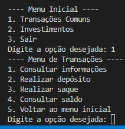

# Trabalho feito para a Faculdade - Linguagem Orientada a Objetos - JAVA

 Uma pequena aplicação em Java para gerenciamento bancário que possibilite ao usuário informar seu nome, sobrenome e CPF. Além disso, a aplicação deverá possibilitar ao usuário consultar saldo, realizar depositos, saques e simular aplicações em CDB e LDB.

Estou disponibilizando o código, juntamente com o roteiro de aula prática em PDF.

